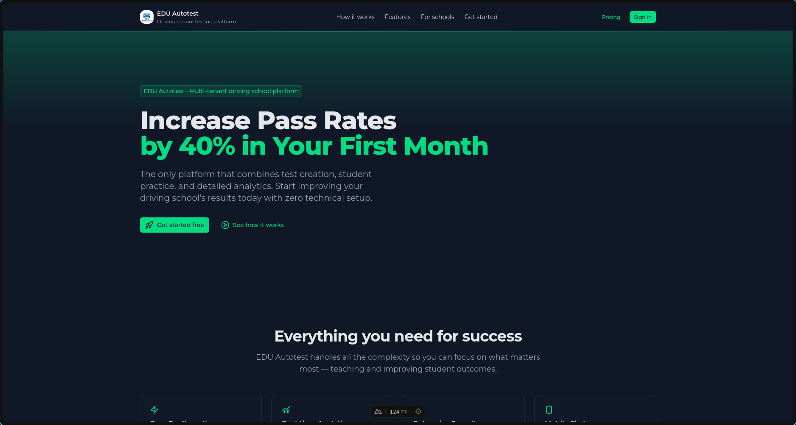

# 🚗 Autotest - Fullstack project

---



## 🛠 Stack

- Nuxt3
- Vue3
- Typescript
- Prisma
- PostgreSQL
- Tailwind
- Bun

## ✨ Main Functions

- **📝 1000+ Test Questions**
- **🎯 Exam Simulation Mode (YXQBB format)**
- **📚 Learning Mode by Categories**
- **🏃 Marathon Mode**
- **📊 Progress Tracking & Statistics**
- **🔄 Error Review & Practice**

## 🚀 Setup

```bash
# Install dependencies
bun install

# Setup environment
cp .env.example .env

# Run migrations
bunx prisma migrate deploy

# Start dev server
bun run dev
```

## 🤝 Contributing

Please report bugs in the [Issues](https://github.com/thisisal1yev/Autotest/issues) section or submit a Pull Request with your suggestions.

## Connection

<a href='mailto:aaalievvv1@gmail.com'>Email</a>
<a href='https://t.me/thisisaliyev'>Telegram</a>